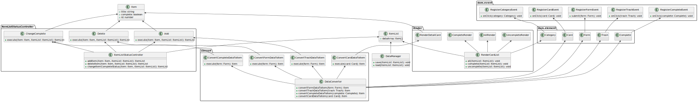

# 単一責任の原則を練習するための TodoApp

## 機能

- Todo の追加
- Todo の削除
- Todo の完了状態の切り替え
- Todo の一覧表示
- 未完了の Todo の一覧表示
- 完了済みの Todo の一覧表示
- Todo の永続化（ブラウザの LocalStorage に保存）

## 要件

- Todo はタイトル（string 型）、完了状態（boolean 型）、ID（number 型）を持つものとする
- Todo の追加・削除・完了状態の切り替えは、それぞれ別々のクラスによって実装すること
- Todo の一覧表示・未完了の Todo の一覧表示・完了済みの Todo の一覧表示は、共通のクラスによって実装すること
- Todo の永続化は、LocalStorage を直接操作することなく、単一責任の原則に従ったクラスによって実装すること

## クラス図

